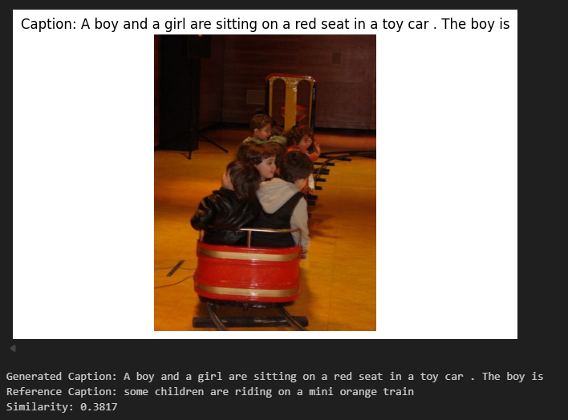

# 🖼️ Image Captioning with ViT + GPT-2  

## 🔍 Giới thiệu  

Dự án này xây dựng một mô hình **Deep Learning** có khả năng sinh chú thích ảnh (**Image Captioning**) bằng tiếng Anh.  
Hệ thống kết hợp:  

- **Vision Transformer (ViT)** 👉 trích xuất đặc trưng ảnh.  
- **GPT-2** 👉 sinh câu mô tả tự nhiên.  
- **Framework**: Hugging Face `transformers` + PyTorch.  
- **Dataset**: Flickr8k (ảnh + caption tiếng Anh).  

---

## 👨‍🏫 Thành viên  

| Họ và Tên       | MSSV      |
|-----------------|-----------|
| Châu Tiểu Long  | 21094341  |

**GV hướng dẫn:** ...  
**Trường:** Đại học Công Nghiệp TP.HCM  

---

## 🎯 Mục tiêu  

- Xây dựng mô hình sinh chú thích ảnh.  
- Ứng dụng Vision Transformer thay CNN để tăng hiệu quả trích xuất ảnh.  
- Sử dụng GPT-2 để tạo caption mượt mà và đúng ngữ nghĩa.  
- Đánh giá chất lượng bằng độ tương đồng với caption gốc.  

---

## 🧰 Công nghệ & thư viện sử dụng  

- **Python, PyTorch, Hugging Face Transformers**  
- **PIL, torchvision** (tiền xử lý ảnh)  
- **Seq2SeqTrainer** (huấn luyện Encoder–Decoder)  

---

## 🖥️ Kiến trúc mô hình  

### 🔧 Cấu trúc Encoder–Decoder  

- **Encoder**: Vision Transformer (ViT) – chia ảnh thành patch, trích xuất đặc trưng toàn cục.  
- **Decoder**: GPT-2 – sinh văn bản mô tả.  
- **Huấn luyện**: `VisionEncoderDecoderModel.from_encoder_decoder_pretrained()`  

### 📐 Cấu hình huấn luyện  

- Epochs: 3  
- Batch size: 8  
- Learning rate: 5e-5  
- Max caption length: 128  
- Beam search: 4  

---

## 📊 Kết quả  

- **Similarity score**: ~ **0.38**  
- Caption sinh ra ngữ nghĩa gần đúng và ngữ pháp tự nhiên.  

---

## 🖼️ Ví dụ  

### Input  
  
### Output Caption  
  
